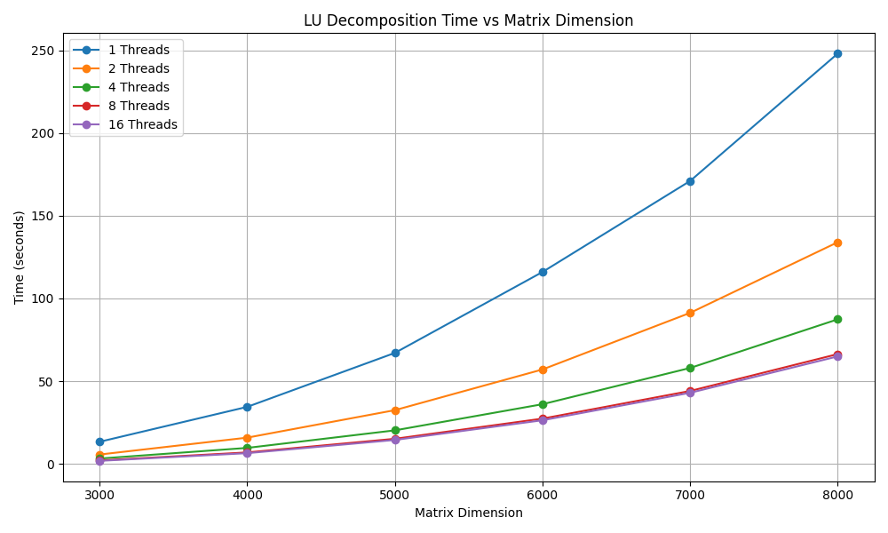
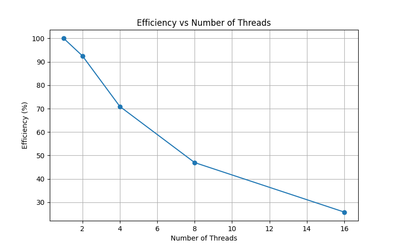
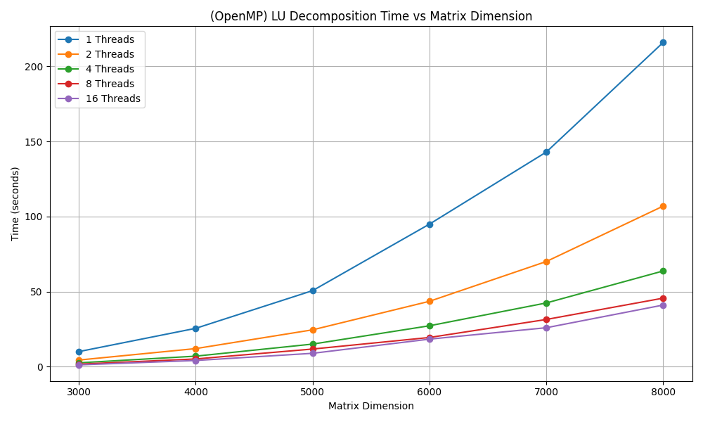

# LU Decomposition

COL380: Assignment 1 

How to Run?

> `chmod +x run.sh`

1. run `./run.sh`
2. In `time.txt` number of threads vs time taken (in sec) will be printed for 8000 X 8000 matrix. Change the dimentions in `run.sh` file.
3. Set `VERIFY` to `1` to check the correctness. The norm should be very small. Dont check for large matrices, since its $O(n^3)$
4. Benchmarking only the LU decomposition part, not the initialization and verification part. (Used `timer.cpp`)
5. Compiled using `-O3` flag enabled. 


# COL 380 (A1): LU Decomposition

### Shivam Verma (2020CS50442), Shivam Jain (2020CS50626), Varshita Verma (2021CS10586)

#### Initialization of the matrices

Matrices are initialized as vectors of vectors of floating-point numbers (`float`). This approach facilitates dynamic allocation of matrices on the heap during runtime, with the input dimension `n` determined through command-line parameters. The following code excerpt demonstrates the initialization process:

```c++
matrix = new std::vector<std::vector<double>>(n, std::vector<double>(n));
L = new std::vector<std::vector<double>>(n, std::vector<double>(n));
U = new std::vector<std::vector<double>>(n, std::vector<double>(n));
```

Given the potential size of the matrices, reaching dimensions of up to $8000 \times 8000$, initialization is parallelized to enhance efficiency. In case of `Pthread` implementation, each thread is responsible for initializing a portion of the matrix based on its assigned `thread_id`. The parallelization strategy aims to optimize performance by distributing the workload among multiple threads effectively.

The function `initialize` is designed to execute the initialization process in parallel. The snippet below illustrates the implementation of parallel initialization:

```c++
void *initialize(void *arg) {
    int thread_id = static_cast<int>(reinterpret_cast<long>(arg));
    std::random_device rd;
    std::mt19937 gen(rd());
    std::uniform_real_distribution<double> dis(0.0, 1000.0);

    for (int i = thread_id; i < n; i += numThreads) {
        for (int j = 0; j < n; ++j) {
            (*matrix)[i][j] = dis(gen);
            (*matrix_1)[i][j] = (*matrix)[i][j];
            (*U)[i][j] = 0;
            (*L)[i][j] = (j == i ? 1 : 0);
        }
    }
    return NULL;
}
```

In the OpenMP version, the initialization function follows a similar parallelization strategy to the Pthread implementation. The goal is to efficiently distribute the workload among multiple threads, where each thread is responsible for initializing a portion of the matrix based on its thread ID. 
The OpenMP directives are employed to achieve parallelization. These directives, delegate the responsibility of managing and distributing threads to the OpenMP runtime, making it easier to parallelize sections of code without having to manually handle thread creation and synchronization.

The snippet below illustrates the implementation:

```c++
void *initialize() {
    int thread_id = omp_get_thread_num();// This gives the index of thread
    std::random_device rd;
    std::mt19937 gen(rd());
    std::uniform_real_distribution<double> dis(0.0, 1000.0);

    for (int i = thread_id; i < n; i += numThreads) {
        for (int j = 0; j < n; ++j) {
            (*matrix)[i][j] = dis(gen);
            (*matrix_1)[i][j] = (*matrix)[i][j];
            (*U)[i][j] = 0;
            (*L)[i][j] = (j == i ? 1 : 0);
        }
    }
    return NULL;
}
```

#### Algorithm for Computation

Upon examining the sequential LU Decomposition algorithm, it was identified that the major computational burden lies within the nested loops responsible for updating matrix elements. The complexity of this section is $O(n^3)$ due to two inner loops iterating over variables $i$ and $j$, and an outer loop iterating over variable $k$.

```c++
for i = k+1 to n
	for j = k+1 to n
		a(i,j) = a(i,j) - l(i,k) * u(k,j)
```

The remaining portion of the code contributes insignificantly, consuming less than 10% of the total computation time. Therefore, optimizing the inner loops for parallel execution is crucial to overall performance enhancement.

In case of `Pthread` implementation, the strategy involved distributing the workload among `numThreads` concurrently executing threads. Each thread executed the `compute` function in parallel, updating matrix elements within its designated portion. The following code snippet illustrates the distribution of work among threads:

```c++
for (int i = 0; i < numThreads; ++i) {
    args[i].k = k; 
    args[i].start = (k + 1) + i * ((n - k - 1) / numThreads);
    args[i].end = (k + 1) + (i + 1) * ((n - k - 1) / numThreads);
    if (i + 1 == numThreads && args[i].end != n) {
        args[i].end = n;
    }
    pthread_create(&threads[i], NULL, compute, (void *)&args[i]);
}
for (int i = 0; i < numThreads; ++i) {
    pthread_join(threads[i], NULL);
}
```

The `compute` function, invoked by each thread, performs parallel computation of matrix elements within the assigned range:

```c++
void *compute(void *arg) {
    struct ThreadData *data = (ThreadData *)arg;
    int k = data->k;
    int start = data->start;
    int end = data->end;

    for (int i = start; i < end; i++) {
        for (int j = k + 1; j < n; j++) {
            (*matrix)[i][j] -= (((*U)[k][j]) * ((*L)[i][k]));
        }
    }
    return NULL;
}
```
Same `compute` function is being used in case of OpenMP (where the parallel loop updates matrix elements within the specified range for each thread), and similar to the pthreads the strategy involves distributing the workload among numThreads concurrently executing threads. The main computation loop, which performs the LU Decomposition, is parallelized using OpenMP directives. The "#pragma omp parallel for" directive distributes the loop iterations among the available threads.

The following code snippet illustrates the distribution of work among threads:

```c++
        ThreadData args[numThreads];

            #pragma omp parallel num_threads(numThreads)
            {
                int i = omp_get_thread_num();
                args[i].k = k;
                args[i].start = (k + 1) + i * ((n - k - 1) / numThreads);
                args[i].end = (k + 1) + (i + 1) * ((n - k - 1) / numThreads);
                if (i + 1 == numThreads && args[i].end != n) {
                    args[i].end = n;
                }
                compute((void *)&args[i]);
            }
```

In the pthreads implementation, explicit thread creation and management are done using the pthread_create and pthread_join functions. Threads are created individually, and the management of thread-specific data is handled manually.
In the OpenMP implementation, thread creation and management are abstracted through compiler directives. The #pragma omp parallel directive creates a team of threads, and the loop pragma (#pragma omp for) automatically distributes the loop iterations among the available threads.


#### Verification of the Results

> Here, the vector π is a compact representation of a permutation matrix p(n,n), which is very sparse. For the ith row of p, π(i) stores the column index of the sole position that contains a 1.

To ensure the correctness of the optimized implementation, result verification procedures were conducted. The verification involved constructing matrix `P` from the permutation vector `pi`, computing matrices $X = P \times matrix$ and $Y = L \times U$ using standard matrix multiplication algorithm, and calculating the norm of the residual matrix ($X-Y$). The obtained norm, within the order of $1e-10$, confirms the correctness of the computation.

Verification involves:

1. Construction of Verification Matrices:

In both OpenMP and Pthread implementations, the code constructs matrices P, PA, and LU to facilitate result verification. These matrices are constructed based on the permutation vector _pi, the original matrix matrix_1, and the computed matrices L and U.

```c++
std::vector<std::vector<double>> *P =
            new std::vector<std::vector<double>>(n,
                                                 std::vector<double>(n, 0.0));
        for (int i = 0; i < n; i++) {
            (*P)[i][_pi[i]] = 1;
        }
        std::vector<std::vector<double>> *PA = matrixMultiply(P, matrix_1);
        std::vector<std::vector<double>> *LU = matrixMultiply(L, U);
```

2. Calculation of Residual Norm:

After constructing the matrices, the code calculates the norm of the residual matrix obtained by subtracting LU from PA. The norm is computed using a nested loop.

```c++
double norm = 0.0;
        for (int i = 0; i < n; i++) {
            for (int j = 0; j < n; j++) {
                auto x = (*PA)[i][j] - (*LU)[i][j];
                norm += (x * x);
            }
        }

        norm = std::sqrt(norm);
        std::cerr << "[DEBUG] The error norm is: " << norm << '\n';
```

3. Consistency Check:

The norm value is then used for a consistency check. If the norm is within a certain threshold (e.g., $1e-10$), it is considered acceptable, and the algorithm is deemed to have produced correct results.

```c++
if (VERIFY == 1) {
    // Perform consistency check based on the computed norm
}
```

This verification process ensures that the LU decomposition in the pthread and OpenMP implementation produces results consistent with the original matrix and meets the desired precision. The calculated error norm provides a quantitative measure of the accuracy of the parallelized LU decomposition algorithm.


#### Optimisations

1. Loop Restructuring for Cache-Friendly Access: 

We tried to make our code as cache friendly as possible. Changing the simple loop structure from

   ```c++
   for (int j = k + 1; j < n; j++) {
   	for (int i = start; i < end; i++) {
           (*matrix)[i][j] -= (((*U)[k][j]) * ((*L)[i][k]));
       }
   }
   ```

   to

   ```c++
   for (int i = start; i < end; i++) {
       for (int j = k + 1; j < n; j++) {
           (*matrix)[i][j] -= (((*U)[k][j]) * ((*L)[i][k]));
       }
   }
   ```

   brought about 10 times improvement in performance. The initial implementation of the algorithm exhibited a significant number of cache misses, adversely impacting performance. To address this issue, a careful restructuring of the loop order was undertaken to maximize cache utilization. By rearranging the loop structure to prioritize cache-friendly memory access patterns, the algorithm effectively minimized cache misses, thereby significantly reducing memory access latency and enhancing overall execution speed.


   In the OpenMP implementation, similar to the Pthread version, a crucial optimization was achieved by restructuring the loop order to maximize cache utilization.


2. Struct Alignment to Minimize False Sharing:

By aligning the struct size to 64 bytes, false sharing was minimized, leading to improved cache performance and overall code efficiency.

   > False sharing occurs when adjacent elements of the cache line are accessed by different threads, leading to cache contention and degraded performance.

   In the initial implementation, the size of the ThreadData struct was only 12 bytes, resulting in inefficient cache utilization and increased cache misses. To mitigate false sharing, the struct size was increased to 64 bytes using the `alignas` directive, effectively adding appropriate padding.

   ```c++
   struct alignas(64) ThreadData {
       int k;
       int start, end;
       ThreadData() {}
   };
   ```

   By aligning the size of the ThreadData struct to 64 bytes, false sharing was significantly reduced. This optimization ensured that each thread's ThreadData remained within its own cache line, minimizing cache contention and improving cache coherence. As a result, the performance of the LU Decomposition algorithm was enhanced, contributing to overall code efficiency.

These optimizations collectively contribute to the efficient parallel execution of the LU Decomposition algorithm using OpenMP, resulting in improved performance and reduced cache-related bottlenecks.

#### Results

All the testing was done on Haswell Nodes on HPC with following configuration:

> Number of nodes = 1
> Number of cpu = 20
> Number of gpu = 2
> Memory = 24GB
>
> c++ version 11 was used with -O3 flag optimisation.

Files pthread-time.txt and omp-time.txt contains results for different values of n(matrix-dimention) and number of threads.

##### <u>Pthread</u>

The following results were obtained for the Pthread implementation.



Here we can see that for $8000 \times 8000$ matrix the sequential implementation takes around 250 seconds to run, whereas for 16 threads it takes just around 60 seconds.

| Number of Threads | Time in seconds (8000 X 8000 matrix) |
| ----------------- | ------------------------------------ |
| 1                 | 248 seconds                          |
| 2                 | 134 seconds                          |
| 4                 | 87.4 seconds                         |
| 8                 | 66 seconds                           |
| 16                | 60 seconds                           |

**<u>Speedup and Efficiency</u>**

Efficiency $\tau_N = \frac{T_1}{T_N \times N}$  and Speedup $S_N = \frac{T_1}{T_N}$

Below is the plot for Efficiency vs Number of Threads for $8000 \times 8000$ matrix.



##### <u>OpenMP</u>

The following results were obtained for the OpenMP implementation.



Here we can see that for $8000 \times 8000$ matrix the sequential implementation takes around 216 seconds to run, whereas for 16 threads it takes just around 41 seconds.

| Number of Threads | Time in seconds (8000 X 8000 matrix) |
| ----------------- | ------------------------------------ |
| 1                 | 216 seconds                          |
| 2                 | 107 seconds                          |
| 4                 | 63.8 seconds                         |
| 8                 | 45.7 seconds                         |
| 16                | 41.1 seconds                           |


Below is the plot for Efficiency vs Number of Threads for $8000 \times 8000$ matrix.

